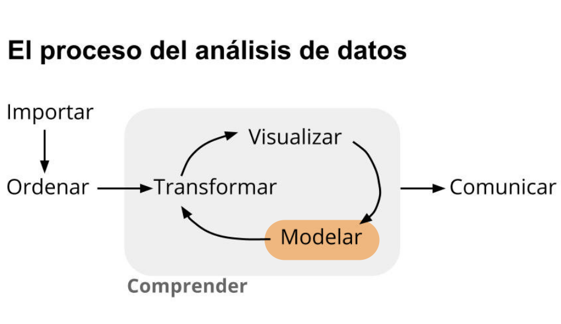

```{r setup, include=FALSE}
knitr::opts_chunk$set(echo = TRUE, comment = NA)
library(summarytools)

```

</br></br>

```{r, echo=FALSE, out.width="100%", fig.align = "center"}

```
</br></br>

La **modelación** forma parte principal del proceso de análisis de datos y permite avanzar hacia la toma de decisiones infomadas 


```{r, echo=FALSE, out.width="50%", fig.align = "center"}

```
<center>Tomado de : Ciencias de Datos para Gente Sociable</center>

</br></br>

Dependiendo el problema a ser abordado, se utiliza una herramienta estadística diferente para el proceso de modelación. Dentro de los modelos más utilizados se destacan: el modelos de Regresión Lineal, la Regresión Logistica, el Análisis de Componente Principales, el Análisis Discriminante, el Modelo Lineal Generalizado, el Modelo Lineal Mixto Generalizado, el modelo de Regresión de Cox y el modelo de series de tiempo, entre otros

</br>

La estructura general de los modelos es de la forma :

<br/>

$$Y_i = \beta_0 + \beta_1X_{i1} + \beta_2X_{i2} + \cdots + \beta_kX_{ik} + \varepsilon_i,\hspace{1cm} i = 1, \ldots, n,$$
</br>

Donde $Y_{i}$, es la variable respuesta o dependiente y el conjunto de variables $X_{1},X_{2}, \ldots X_{k}$, conforman las varialbes independientes o regresoras. Adicionalmente el modelo contiene una variable $\varepsilon$, que debe poseer unas caracteristicas especiales.

</br></br>

En esta unidad se presentan los conceptos básicos de la modelación estaística, particularmente del **modelo de regresión lineal simple**, los supuestos que lo riguen y el proceso de inferencia estadísticas relacionada con los parámetros. Previamente se discute el concepto de correlación.

</br>

$$Y_i = \beta_0 + \beta_1X_{i} + \varepsilon_i,\hspace{1cm} i = 1, \ldots, n,$$
</br></br>