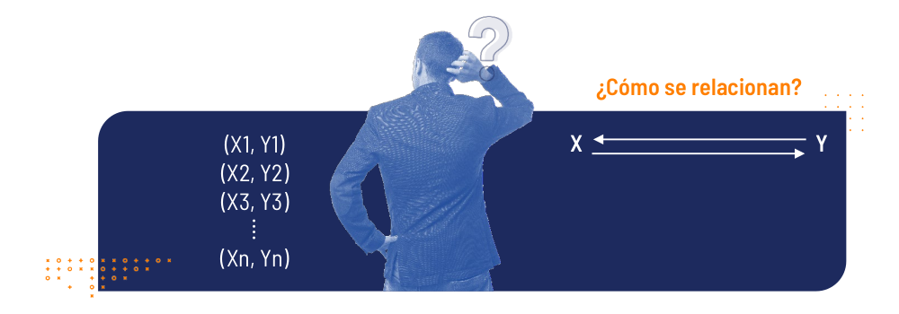
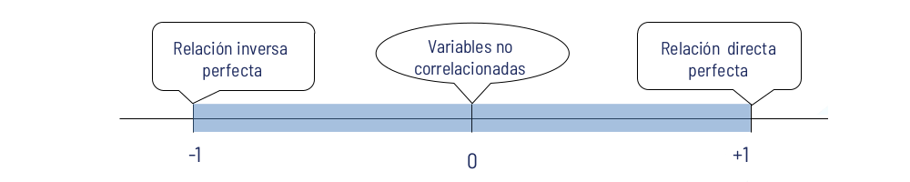

```{r setup, include=FALSE}
knitr::opts_chunk$set(echo = TRUE, comment = NA)
library(tidyverse)
# install.packages("PerformanceAnalytics")
library(PerformanceAnalytics)

c1="#FF7F00"
c2="#=EB0C6"
c3="#034A94"
c4="#686868"
#-------------------------------------------------------------------------
gen.corr.data<- function(rho,n){
x <- rnorm(n)
z <- rnorm(n)
y<- rho*x + sqrt(1-rho^2)*z
result <-cbind(y,x)
return(result)
}
#-------------------------------------------------------------------------
library(ggplot2)
library(patchwork)
Theme1= theme(axis.text.x = element_blank(),
        axis.text.y = element_blank(),
        axis.ticks = element_blank(),
        axis.title.x = element_text(size = 12),
        axis.title.y = element_text(size = 12))
#------------------------------------------------------------------------
Theme2= theme(
        #axis.text.x = element_blank(),
        #axis.text.y = element_blank(),
        #axis.ticks = element_blank(),
        axis.title.x = element_text(size = 11),
        axis.title.y = element_text(size = 11))

biomasa=paqueteMOD::biomasa
biomasa38=biomasa[,3:8]

```


</br></br></br>

```{r, echo=FALSE, out.width="60%", fig.align = "center"}
# knitr::include_graphics("img/procesodatos.png")
```

 
El **análisis de correlación** es una técnica estadística que se emplea para describir el grado de relación lineal existente entre un par de variables cuantitativas. Para este análisis se dispone de una variable $Y$, que puede estar o no relacionada estadísticamente con otra variable $X$ y de la cual se desea  a partir de una muestra de $n$ pares de observaciones, calcular un indicador que mida la relación.
  
</br></br>

<center>  

```{r, echo=FALSE, out.width="100%", fig.align = "center"}

```

</center>  

</br></br>

<span style="color:#FF7F00"> **Ejemplos**</span>
  

* ¿Existe relación entre la inversión en publicidad de una empresa y sus ventas mensuales?
  
* ¿El número de metros cuadrados en una casa está relacionado con su costo de venta?
  
* ¿Existe relación entre los kilómetros por galón consumidos y el peso del auto?
  
* ¿Hay relación entre el número de horas que estudian los alumnos para un examen y la calificación que obtienen?
  
* ¿Qué relación existe entre el peso y la estatura de los estudiantes?
  
* ¿Existe relación entre la tasa de desempleo y la tasa de homicidios?
  
* ¿Hay relación entre la cantidad de medidas preventivas de tránsito y el número de accidentes de tránsito?
  
* ¿Son fuertes o débiles estas asociaciones? ¿Son directas o indirectas?
  
</br></br>
  
**Entre las principales herramientas del análisis de correlación se encuentran:**

</br>
  
* **Gráficos de dispersión**: “Representación gráfica simultanea del par de variables estudiadas”.

</br>

* **Coeficiente de correlación**: “Indicador que mide la fuerza de la relación lineal entre un par de variables”.


</br></br>
  
## <span style="color:#034a94">**Gráfico de dispersión**</span> 
  
Es un gráfico en el cual se representan las parejas ($X,Y$) de las variables observadas. La forma que toman los puntos, ilustra acerca de la posible asociación existe entre las variables.


</br></br>

<center>
  
```{r, echo=FALSE}
muestra1<-gen.corr.data(0.8,200)
muestra1<-as.data.frame(muestra1)


p1=ggplot(muestra1, aes(x, y)) + 
         geom_point() + Theme1+
         labs(title = "", y= "y", x= " ") +
         annotate("text", x=-3.3, y=3,size=4, label= "(a)")


muestra2<-gen.corr.data(-0.7,200)
muestra2<-as.data.frame(muestra2)

p2=ggplot(muestra2, aes(x, y)) + 
          geom_point() + Theme1+
          labs(title = "", y= " ", x= " ")+
          annotate("text", x=-3, y=3,size=4, label= "(b)")

muestra3<-gen.corr.data(0,200)
muestra3<-as.data.frame(muestra3)

p3=ggplot(muestra3, aes(x, y)) +  
          geom_point() + Theme1+
          labs(title = "", y= "y", x= "x")+
          annotate("text", x=-3, y=3,size=4, label= "(c)")


x=seq(-1, 1, 0.01)
y=x^2+rnorm(201, 0,0.1)
muestra5<-data.frame(x,y)

  
p5=ggplot(muestra5, aes(x, y)) + 
          geom_point() + Theme1+
          labs(title = "", y= " ", x= "x")+ 
          annotate("text", x=-1.2, y=1.2,size=4, label= "(d)")


(p1+p2)/(p3+p5)
```
  
Figura 1: Gráfico de dispersión y relaciones entre variables.

</center>

</br>

* (a) Relación lineal positiva (directa o creciente)
* (b) Relación lineal negativa (indirecta o decreciente)
* (c) No relación lineal
* (d) Relación no lineal

</br></br>

<span style="color:#FF7F00"> **Ejemplo**</span>
  
Identificar la posible relación lineal observada entre las variables:

*  $X$ : Cantidad de horas trabajadas en una empresa.
*  $Y$ : Cantidad de unidades producidas en la empresa.

<center>  

```{r, echo=FALSE}
data7=data.frame(x = c( 72, 75, 77, 78 ,79, 80, 80, 82, 83, 84 ,85),
                 y = c(310,305,320,300,302,300,310,300,315,320,307))

ggplot(data7, aes(x, y)) + 
          geom_point(size=3, colour=c1 ) + Theme2 +
          labs(title = "", 
               y= "Cantidad de unidades producidas", 
               x= "Cantidad de horas trabajadas")
```

</center>  

Figura 2: Diagrama de dispersión entre las horas trabajadas y las unidades producidas en una empresa.

</br></br>

De acuerdo con el gráfico de dispersión de la figura 2, se observa una falta de relación lineal entre las variables cantidad de horas trabajadas en una empresa y la cantidad de unidades producidas en la empresa.

</br></br>

<span style="color:#FF7F00"> **Ejemplo**</span>
  
Identificar la posible relación lineal observada entre las variables:
  
* $X$ : Tiempo  de la duración de una conferencia (en minutos).
* $Y$ : Índice de la capacidad de atención en la conferencia  (1: Poca,..., 10: Mucha).

</br></br>

<center>  

```{r, echo=FALSE}
data6=data.frame(x=c(30,30,40,60,70,70,80,80,90,90,90,100,110,120,130,140),
                 y=c( 1, 3, 5, 6, 6, 7, 8, 9, 8, 9,10,  7,  5,  3,  2, 1))

ggplot(data6, aes(x, y)) + 
          geom_point(size=3, colour=c1) + Theme2 +
          labs(title = "", 
               y= "Índice de capacidad de atención", 
               x= "Tiempo de duración de conferencia (min)")
```

</center>  

Figura 3: Diagrama de dispersión entre el tiempo de duración de una conferencia y el índice de capacidad de atención en la misma.

</br></br>

En este caso la gráfica 3 muestra una relación cuadrática, marcando claramente un valor máximo del indice de atención (80 min), despues del cual el indice decae. 

</br></br>
  
## <span style="color:#034a94"> **Coeficiente de correlación**</span>
  
Es una medida de la magnitud de la **asociación lineal** entre dos variables. Indica si los puntos tienen una tendencia a disponerse alineadamente y es útil para determinar si hay relación lineal entre las variables. El coeficiente de correlación presenta las siguientes características:
  
  
* Sólo toma valores entre $-1$ y $1$.
* Cuanto más cerca esté de $1$ o $-1$ mejor será el grado de relación lineal. Siempre y cuando no existan observaciones anómalas.


</br>
  
```{r, echo=FALSE, out.width="100%", fig.align = "center"}

```

</br>
  
Un valor cercano a 1 indica asociación directa o positiva y un valor cercano a -1 indica asociación inversa o negativa. Si el valor es cercano a 0 indica una asociación débil.

* Se denota con la letra $r$ y su fórmula de cálculo es la siguiente:
  
</br></br>

$$r = \dfrac{n \Bigg(\displaystyle\sum_{i=1}^{n} x_{i}y_{i} \Bigg) \Bigg(\displaystyle\sum_{i=1}^{n} x_{i} \Bigg) \Bigg(\displaystyle\sum_{i=1}^{n} y_{i}\Bigg)}{
    {\sqrt{n \Bigg(\displaystyle\sum_{i=1}^{n} x_{i}^{2} \Bigg) - \Bigg(\displaystyle\sum_{i=1}^{n} x_{i} \Bigg)^{2}} } {\sqrt{n \Bigg(\displaystyle\sum_{i=1}^{n} y_{i}^{2} \Bigg) - \Bigg(\displaystyle\sum_{i=1}^{n} y_{i} \Bigg)^{2}}}}$$
    
</br></br>
  
$$r = \dfrac{cov(x,y)}{\sqrt{s_{x}^{2}\hspace{0.1cm} s_{y}^{2}}}$$

</br></br>

Este indicador fué propuesto por Karl Pearson por lo que se conoce como **coeficiente de correlación de Pearson** y exige que las variables $X$ y $Y$ sean variables cuantitavas en escala de intervalo o de razón y normalidad de las variables.

</br></br>

Los valores obtenidos del coeficiente de correlación permiten clasificar la relación lineal entre las variables de la siguiente forma:
  
  </br>
  
  | Coeficiente de corelación  | Relación lineal             |
  |:--------------------------:|:---------------------------:|
  | $0.8 \leq r < 1.0$         |  Positiva fuerte            |
  | $0.3 \leq r < 0.8$         |  Positiva debil             |
  | $-0.3 < r < 3$             |  No existe                  |
  | $-0.8 < r \leq -0.3$       |  Negativa debil             |
  | $-1.0 \leq r \leq -0.8$    |  Negativa fuerte            |
  
Tabla 1: Clasificación de la relación lineal entre variables por medio del coeficiente de correlación.

</br></br>
  

<span style="color:#FF7F00"> **Ejemplo**</span>
  
Se cuenta con la información de una muestra aleatoria de 6 pueblos del departamento, donde se observaron las variables número de policías y número de delitos
registrados durante el mes pasado, la información obtenida se presenta a continuación:
  
Mediante el coeficiente de correlación identificar el tipo de relación que pueda existir entre estas dos variables.

Sea $X$ la variable que representa el número de policías y sea $Y$ la variable que representa el número de delitos. Para construir el coeficiente se requieren las sumatorias de $x_{i}$, $y_{i}$, $x_{i}^{2}$, $y_{i}^{2}$ y de $x_{i}y_{i}$
  
<pre>
x=c(15,   17,   25,   27,   17,   12)
y=c(17,   13,    5,    7,    7,   21)

n           #    6
sum(x)      #  113 
sum(y)      #   70
sum(x^2)    # 2301
sum(y^2)    # 1022
sum(x*y)    # 1161

cor(x,y)    # [1] -0.8351746
</pre>
  
</br></br>  
  
$$\widehat{\rho}_{_{x,y}}=r=\dfrac{6 (1161)-(113)(70)}{\sqrt{6(2301)-(113)^2}\sqrt{6(1022)-(70)^2}} = -0.80352$$
  
</br></br>

Por lo tanto, el resultado obtenido del coeficiente de correlación $r = −0.8352$, se busca en la tabla 1, y se observa que existe una **asociación lineal negativa y fuerte** entre el número de policías y el número de delitos, es decir que entre más policías en un pueblo menor será el número de delitos en los pueblos.


</br></br>

## <span style="color:#034a94"> **Pruebas de hipótesis sobre $\rho$**</span>

Es importante verificar si de $\rho$ es igual a cero o se puede considerar diferente de cero, a partir de la muestra de estudio. Para ello se utiliza un estadístico de prueba con distribución t-Studen con $v=n-2$ grados de libertad


$Ho: \rho =0$
$Ha: \rho \neq 0$
  
Estadístico de prueba

</br></br>

$$U = \dfrac{r \sqrt{n-2}}{\sqrt{1-r^{2}}} \sim t_{v:n-2}$$
<pre>
x=c(15,   17,   25,   27,   17,   12)
y=c(17,   13,    5,    7,    7,   21)

r=cor(x,y)
r*sqrt(6-2)/sqrt(1-r^2)              # [1] -3.037082

cor.test(x,y, method = "pearson")

Pearson's product-moment correlation

data:  x and y
t = -3.0371, df = 4, p-value = 0.03851
alternative hypothesis: true correlation is not equal to 0
95 percent confidence interval:
 -0.98148791 -0.07328662
sample estimates:
       cor 
-0.8351746 
</pre>

</br></br>

Suponiendo que el valor p obtenido es pequeño, se concluye que $\rho \neq 0$

</br>

En caso de variables no normales, con presencia de datos atípicos o procedentes de variables cualitativas que son cuantificadas a través de escalas de intervalos, se recomienda el uso del **coeficiente de correlación de Spearman**

</br></br>

## <span style="color:#034a94"> **Otros indicadores de correlación**</span>

</br>

**Coeficiente de correlación de Spearman**

Se considera como un coeficiente no paramétrico ( no requiere verificación de supuestos), propuesto por Charles Spearman y se basa en los rangos obtenidos para las variables X y Y. Los rangos se optienen al ordenar los datos y asignarles a cada valor el número del orden correspondiente ($1,2,3,4,5...n$) $R_{i}(x)$ y $R_{i}(y)$

</br></br>

$$\gamma_{s} = \dfrac{ \sum_{i=1}^{n}\Big[\big(  R_{i}(x) - \overline{R}(x)\big) \Big]}{\sqrt{\Bigg[ \sum_{i=1}^{n} \Big(R_{i}(x) - \overline{R}(x)\Big)^{2} \Bigg] \Bigg[ \sum_{i=1}^{n} \Big(R_{i}(y) - \overline{R}(y)\Big)^{2} \Bigg]}}$$

</br></br></br>

## <span style="color:#034a94"> **Matriz de varianzas covarianzas y matriz de correlaciones**</span>

</br>

En el caso de tener más de dos variables incluidas en un modelo es de interés estimar como se relacionan las variables de dos en dos. Este proceso se resumen en forma matricial :

$$
\begin{equation}
\begin{pmatrix}
Var(x_{1}) & Cov(x_{1},x_v{2}) & Cov(x_{1},x_v{3})\\
Cov(x_{2},x_v{1}) & Var(x_{2}) & Cov(x_{2},x_v{3})\\
Cov(x_{3},x_v{1}) & Cov(x_{3},x_v{2}) & Var(x_{3})
\end{pmatrix}
=
\begin{pmatrix}
\sigma^{2}_{1} & \sigma_{12} & \sigma_{13}\\
\sigma_{21} & \sigma^{2}_{2} & \sigma_{23}\\
\sigma_{31} & \sigma_{32} & \sigma^{2}_{3}
\end{pmatrix}
\end{equation}
$$
</br>

Donde $Var(x_{i},x_{i}) = Var(x_{i})$ y $Cov(x_{i},x_{j}= Cov(x_{j},x_{i})$ . Enterminos de correlación :

</br>

$$
\begin{equation}
\begin{pmatrix}
Cor(x_{1},x_{1})     & Cor(x_{1},x_{2}) & Cor(x_{1},x_{3})\\
Cor(x_{2},x_{1}) & Cor(x_{2},x_{2}) & Cor(x_{2},x_{3})\\
Cor(x_{3},x_{1}) & Cor(x_{3},x_{2}) & Cor(x_{3},x_{3})
\end{pmatrix}
=
\begin{pmatrix}
1 & \rho_{_{12}} & \rho_{_{13}}\\
\rho_{_{21}} & 1 & \rho_{_{23}}\\
\rho_{_{31}} & \rho_{_{32}} & 1
\end{pmatrix}
\end{equation}
$$

</br></br>

<span style="color:#FF7F00"> **Ejemplo**</span>

Para la data biomasa almacenada en paqueteMOD  (puede ser cargada con la función paquete::data(biomasa)), se pueden examinar los valores calculados en la matriz de varianzas-covarianzas y en la matriz de correlaciones que se representa tambien utilizando una gama de colores que indican el valor de la corelación y su aproximación a -1 (roja) o 1 (azul)

</br></br>

### **Matriz de varianzas-covarianzas**

</br>

```{r, echo=FALSE, message=FALSE,warning=FALSE}
data("biomasa")
cov38=cov(biomasa38)
round(cov38,3)
```
</br></br>

### **Matriz de correlaciones**

</br>

```{r, echo=FALSE, message=FALSE,warning=FALSE}
cor38=round(cor(biomasa38),3)
cor38
```

</br>

En este caso la diagonal está conformada por unos, dado que $Cor(x_{i},x_{i})=1$.  En el gráfico se utiliza la diagonal para ubicar el nombre de la variable y como $\rho_{_{i,j}} = \rho_{_{j,i}}$ se utiliza la parte superior de la matriz para representar los valores circulos de colores que cambian en tamaño e intensidad de acuerdo al valor obtenido y la parte inferior para ubicar los valores correspondientes.

</br>

```{r b3, echo=FALSE, warning=FALSE, message=FALSE}
library(corrplot)
corrplot::corrplot.mixed(cor38)
```

</br>

Se puede observar que las variables más relacionadas (con mayor correlación) so:

* $Cor(altura, diametro) = 0.94$, lo cual indicaria que árboles altos tienen diámetro de tronco más anchos
</br></br>

<span style="color:#FF7F00"> **Nota**</span>

Para el caso de variables cualitativas existen varios indicadores para medir el grado de asociación entre ellas como son:

<!-- **Asociación lineal de Mantel-Haenszel** : Coeficiente empleado en variables de intervalo, mide el grado de asociación lineal entre dos variables y se define como el cuadrado del coeficiente de correlación de Pearson multiplicado por (n-1).  -->

</br></br>

**Eta** : Utilizada en el caso de analizar los valores de una variable en escala de intervalo o de razón en diferentes grupos establecidos por otra variable en escala nominal. Toma valores entre (0,1). Valores cercanos a cero indicará que el comportamiento de la variable agrupada es independiente de los grupos conformados por la variable nominal. 

</br></br>

**Tau b** y **Tau c de Kendall** :   : Empleados para tablas de contingencia r x c con variables ordinales. Presenta valores extremos en tablas con asociación total. Se diferencian en que el primero se utiliza para tablas con r = c, mientras que el Tau c cuando r $\neq$  c. 

</br></br>

**Kappa** : Utilizado para variables ordinames en tablas de r x c. Bajo el supuesto que las dos variables tiene valores iguales, toma valores entre (-1,1), indicando mínimo o máximo grado de acuerdo entre los valores de las dos variables.

</br></br>

**Lambda** : Este coeficiente se emplea para variables nominales en tablas r x c, tomando valores positivos. Si su valor está cercano a 1, indicará independencia entre las variables.

</br></br>
**Phi** : Este coeficiente es utilizado en tablas 2 x 2 con variable nominales y está basado en el estadistico chi-cuadrado, tomando valores en el rango (0,1), indicando mínimo y máximo nivel de asociación.

</br></br>

**Prueba chi-cuadrado de Pearson** : Determina si las diferencias entre las frecuencias observadas en una tabla de contingencia y las frecuencias esperadas, suponiendo que las variables son independientes, son estadísticamente significativas. En caso de rechazarse Ho, se concluye que las variables son independientes, en caso contrario se asume que hay una relación entre ellas (dependencia).

</br></br>

En nuestro caso nos centraremos en el **coeficiente de correlacion de Pearson** ($\rho_{_{XY}}$)

