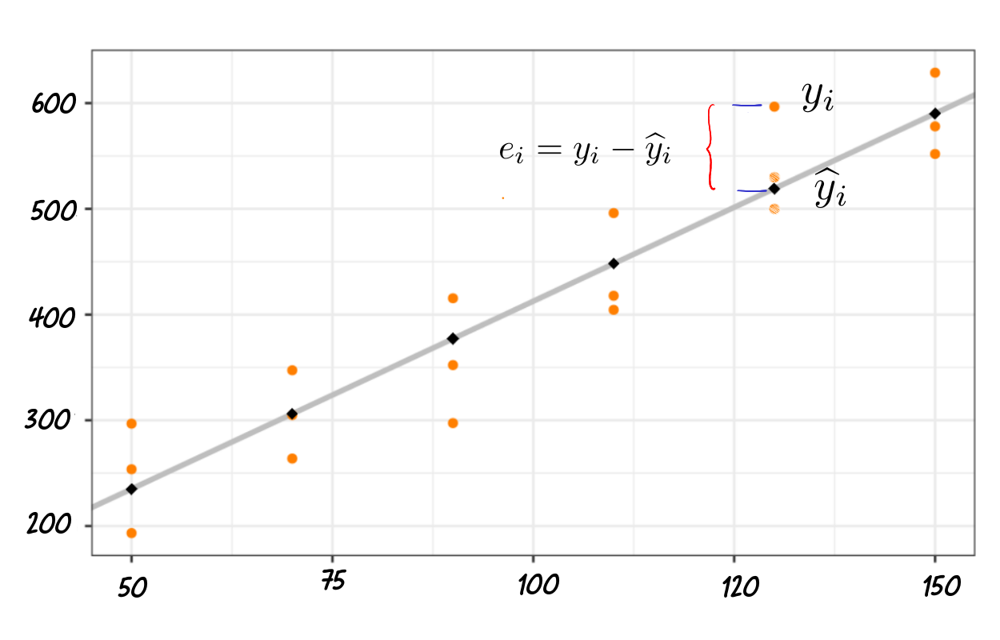

```{r setup, include=FALSE}
knitr::opts_chunk$set(echo = TRUE, comment = NA)
library(tidyverse)
# colores
c0= "#b0394a"
c1= "#ad6395"
c2= "#a391c4"
c3= "#8acfe6"
c4= "#646420"
c5= "#db524f"
paleta4=c("#0d3b66", "#faf0ca", "#f4d35e", "#ee964d")
set.seed(1256)
x <- rep(seq(50, 150, 20), 3)
y <- 62 + 3.5*x + rnorm(18, sd = 50)
df <- data.frame(y, x)
df0 <- df
```


<br/><br/>

## <span style="color:#034a94">**Como prueba de significancia de la regresión**</span> 

</br>
<center>
```{r, include = F}
set.seed(1256)
x <- rep(seq(50, 150, 20), 3)
y <- 62 + 3.5*x + rnorm(18, sd = 50)
df <- data.frame(y, x)
with(df, {plot(x, y, pch = 19)
   abline(h = mean(y), col = 'red', lwd = 2)
   lines(c(50, 100, 150), c(400, 200, 400), type = 's')
})
```
</center>
Para el modelo de regresión lineal simple $Y = \beta_{0}+\beta_{1}X + \varepsilon$ se quiere probar:

$$
\begin{aligned}
{H_0:\ \beta_1 = 0}\nonumber\\
{H_1:\ \beta_1 \neq 0}\nonumber
\end{aligned}
$$
Con base en una descomposición de la variabilidad total observada en la variable respuesta, representada por la suma de cuadrados corregidos en $Y$, $S_{yy}$ (también conocida como suma de cuadrados totales, abreviado SST), en la suma de dos componentes: una debida al modelo propuesto (recta ajustada) y otra debida al error aleatorio.

$$SST =(n-1)\hspace{.2cm} \widehat{\sigma}^{2}_{y} =  \sum_{i = 1}^n \left(y_i - \bar{y}\right)^2$$
</br></br>

Recuerde que el modelo de RLS plantea que la respuesta es igual a la suma de una componente real no aleatoria ${\beta_0+\beta_1X}$ y un error aleatorio ${\varepsilon}$. Se espera que la recta ajustada explique en forma significativa la variabilidad observada en $Y$.

Para ilustrar el enfoque de análisis de varianza, recuerde que:
$$\text{SST} = S_{yy} = \sum_{i = 1}^n \left(y_i - \bar{y}\right)^2$$

veamos lo que representa gráficamente cada una de las diferencias que componen a la SST.

</br></br></br>

<center>

```{r,  echo = F, fig.align = 'center', out.width = '90%'}
knitr::include_graphics("img/grafico1.png")
```
Figura 1: Variabilidd total SST
</center>

</br></br></br>

<center>
```{r, echo = F, fig.align = 'center', out.width = '90%'}

```
Figura 2: Variabilidad en Y al incluir el modelo de RLS
</center>

</br></br></br>

<center>
```{r, echo = F, fig.align = 'center', out.width = '90%'}
knitr::include_graphics("img/grafico3.png")
```
Figura 3: Enfoque de varianza SST = SSR + SSE
</center>

</br></br>

De ahí que podamos escribir cada diferencia $y_i - \bar{y}$ como:

$$y_i - \bar{y} = (\widehat{y}_i - \bar{y}) + (y_i - \widehat{y}_i)$$
</br>

y reemplazando en la SST, se obtiene:

$$
\begin{aligned}
SST = \sum_{i = 1}^n \left(y_i - \bar{y}\right)^2 &= \sum_{i = 1}^n \left[(\widehat{y}_i - \bar{y}) + (y_i - \widehat{y}_i)\right]^2\\
&=\sum^n_{i=1} (\widehat{y}_i - \bar{y})^2 + \sum^n_{i=1} (y_i-\widehat{y}_i)^2
\end{aligned}
$$

</br></br>

<div class="content-box-blue">

### <span style="color:#FF7F00">**Reto:**</span> 

Comprobar que $2\sum_{i = 1}^n (\widehat{y}_i - \bar{y}) (y_i - \widehat{y}_i) = 0$

</div>

</br></br>

Así, la suma de cuadrados totales SST queda expresada mediante la suma de dos componentes, a saber:
  
* $\sum^n_{i=1}(\widehat{y}_i-\bar{y})^2$, que está relacionada con las diferencias entre los valores ajustados por el modelo de regresión y el promedio de las observaciones de la respuesta, al cual se le conoce como Suma de Cuadrados de la Regresión, abreviado SSR.

Se puede demostrar que:

$$
SSR = \sum^n_{i=1}(\widehat{y}_i - \bar{y})^2 = \widehat{\beta}_1S_{xy} = \widehat{\beta}_1^2S_{xx}
$$

</br>

* $\sum^n_{i=1}(y_i-\widehat{y}_i)^2$, que está relacionada con las diferencias entre las observaciones de la respuesta y los valores ajustados por el modelo de regresión, esto es, los residuales del modelo (que son estimaciones de los errores del modelo), por lo que a esta componente se le conoce como Suma de Cuadrados del Error, abreviado SSE.

</br>

Se puede demostrar que:
$$
SSE = \sum^n_{i=1} e^2_i = \sum^n_{i=1}(y_i-\widehat{y}_i)^2 =  S_{yy}-\widehat{\beta}_1 S_{xy}
$$

De donde, se obtiene que:
$$
SST = SSR + SSE
$$

</br>

la cual se conoce como Identidad de Suma de Cuadrados.

Cada una de estas sumas de cuadrados tiene asociados unos grados de libertad (g.l), que representan la cantidad de información libre en la suma de cuadrados. Una forma de calcular los g.l es la diferencia entre el número de observaciones y el número de parámetros estimados en la suma de cuadrados.

</br>

* Se sabe que SST se construye con $n$ observaciones y se estima la media de la respuesta con el promedio, de manera que SST tiene $n - 1$ g.l.

* Analizando la expresión para SSE, se tienen las mismas $n$ observaciones y se estiman los dos parámetros del modelo, y así SSE tiene $n - 2$ g.l.

* Finalmente, SSR solo tiene dos observaciones (los estimadores de los parámetros) y se estima un parámetro, de donde SSR tiene sólo 1 g.l.

</br>

En virtud de lo anterior, los grados de libertad (g.l) de las sumas de cuadrados también forman una identidad, así:

\begin{center}
$\begin{array}{ccccc}
\text{g.l(SST)} & = & \text{g.l(SSR)} & + & \text{g.l(SSE)}\\
(n-1) & = & (1) & + & (n-2)
\end{array}$
\end{center}

A continuación, se definen los cuadrados medios como la razón entre las sumas de cuadrados y sus respectivos grados de libertad. Esto es,

</br>

* $MSR = SSR/g.l(SSR) = SSR$.

</br>

* $MSE = SSE/g.l(SSE) = SSE/(n - 2)$.

</br>

Con el fin de establecer inferencias basadas en el enfoque del análisis de varianza se requiere conocer el valor esperado de cada una de los cuadrados medios, es decir, lo que se estima con cada suma de cuadrados.

Se puede demostrar que:

</br>

* $E\left[MSE\right] = \sigma^2$.

</br>

* $E\left[MSR\right] = \sigma^2 + \beta_1^2S_{xx}$.

</br>

El primer resultado se conocía de la estimación de $\sigma^2$ vista previamente.

Si todas las observaciones $Y_i$ provienen de la misma distribución normal con media $\mu = \beta_0$ (esto es, si $\beta_1 = 0$) y varianza $\sigma^2$, y además se tiene la identidad de sumas de cuadrados que establece que SST $=$ SSR + SSE, con la respectiva identidad de grados de libertad $(n-1) = 1 + (n-2)$, entonces:

</br>

* $SSR/\sigma^2$ se distribuye como una variable aleatoria chi-cuadrado con $1$ grado de libertad.

</br>

* $SSE/\sigma^2$ se distribuye como una variable aleatoria chi-cuadrado con $n - 2$ grados de libertad.

</br>

* Los términos $SSR/\sigma^2$ y $SSE/\sigma^2$ son estimaciones independientes de $\sigma^2$.


De lo anterior, se considera el siguiente estadístico:

</br>

$$
F_0 = \dfrac{SSR/\sigma^2}{SSE/\left[\sigma^2(n-2)\right]}=\dfrac{MSR}{MSE}
$$

</br>

que bajo la hipótesis nula ${H_0:\ \beta_1 = 0}$, se distribuye como una $F$ con 1 y $n - 2$ grados de libertad:

</br>

En el caso de la regresión lineal simple, la prueba sobre la significancia de la regresión (es decir, si la pendiente de la recta es significativamente diferente de cero) puede realizarse mediante el análisis de varianza usando un valor crítico ${F_{\alpha, 1, n - 2}}$ de la distribución ${F}$.

</br>

Esto es, a un nivel de significancia ${\alpha}$ se rechaza la hipótesis nula de que la variabilidad en la variable respuesta es debida sólo al error aleatorio (en favor de la hipótesis de que la regresión en ${X}$ es significativa) si ${F_0 > F_{\alpha, 1, n - 2}}$.

</br></br>

## <span style="color:#034a94">**Tabla de Análisis de Varianza para el modelo de RLS.**</span>
         
</br>

| Fuente de variación | Suma de cuadrados | Grados de libertad | Cuadrado medio | F calculada |
|----|----|----|-----|----|
| Regresión o Modelo | SSR | 1 | $\small \text{MSR} = \text{SSR}$ | $F_{_{0}}=\frac{\text{MSR}}{\text{MSE}}$ |
| Error o Residual | SSE | $n-2$ | $\text{MSE} = \frac{\text{SSE}}{n-2}$ |
| Total | SST | $n-1$| | |

</br>

También se puede evaluar el valor ${p}$ de la prueba (\emph{significancia más pequeña que conduce al rechazo de ${H_0}$}) que es igual a ${P(F_{1,n-2}>F_{0})}$ y determinar si es "pequeño" para rechazar la hipótesis nula: "el modelo lineal de ${Y}$ en ${X}$ no es significativo para explicar la variabilidad de ${Y}$".

</br>

La conclusión obtenida por el análisis de varianza debe ser la misma que la obtenida cuando se prueba la significancia de la pendiente de la recta de regresión.


</br></br>

## <span style="color:#034a94">**Coeficiente de determinación muestral**</span>

</br>

Conocido como $R^{2}$, es una medida del ajuste del modelo que provee un indicador de que tan bien la predictora $X$ predice a la respuesta $Y$. Se calcula como:

$$
R^2 \hspace{.3cm} = \hspace{.3cm} \dfrac{SSR}{SST} \hspace{0.3cm}= \hspace{.3cm} 1-\frac{SSE}{SST}
$$
           
El $R^2$ se puede interpretar como la proporción de la variabilidad total observada en la variable respuesta que es explicada por la relación lineal con la variable predictora considerada.

</br></br>

<div class="content-box-blue">

### <span style="color:#FF7F00">**Interpretaciones erróneas**

* $R^2$ alto indica que el modelo puede hacer predicciones útiles.

* $R^2$ alto indica que la recta de regresión tiene buen ajuste.

* $R^2$ cercano a cero indica que $X$ y $Y$ no están relacionados.

</div>

Las dos primeras indican que aunque un $R^2$ cercano a 1 indica una mayor asociación lineal, no necesariamente garantiza que los supuestos básicos del modelo lineal se estén cumpliendo y menos que el modelo lineal no pueda presentar falta de ajuste.

</br>


