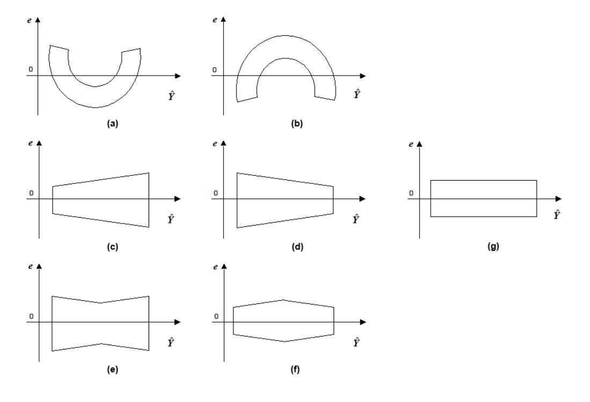
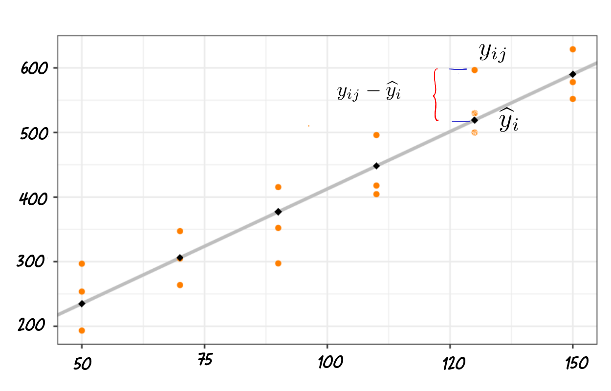
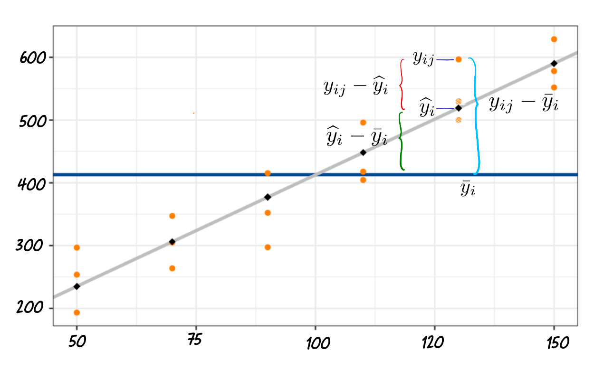
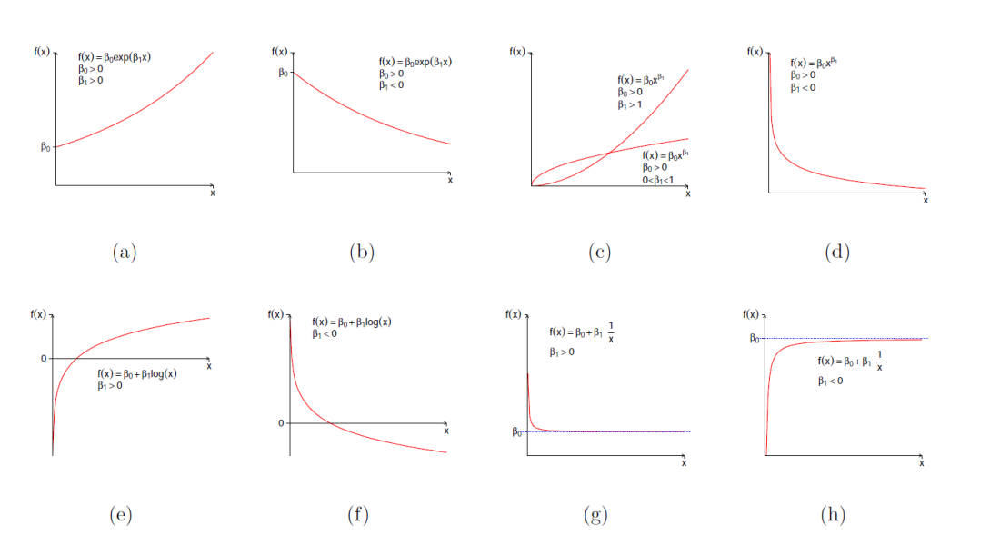

```{r setup, include=FALSE}
knitr::opts_chunk$set(echo = TRUE, comment = NA)
library(vembedr)
library(tidyverse)
library(MASS)
c1="#FF7F00"
c2="#=EB0C6"
c3="#034A94"
c4="#686868"

```

</br></br>

## <span style="color:#034a94"> **Validación de supuestos**

Los supuestos sobre los errores asumidos en el modelo de **RLS** se pueden resumir como:

<div class="content-box-blue">
$$
{\varepsilon_i\overset{\text{iid}}{\sim} N(0,\sigma^2), \hspace{1cm} i=1,\ldots,n}
$$
</div>
           
donde, **iid** es la abreviación de independiente e idénticamente distribuido.

</br>

Luego, para la validación del modelo se deben probar los supuestos:

</br>

|                                                  |                                           |
|:-------------------------------------------------|:------------------------------------------|
| Los errores del modelo tienen media cero         | $E[\varepsilon] = 0$                      |
| Los errores del modelo tienen varianza constante | $V[\varepsilon] = \sigma^{2}$             |
| Los errores del modelo se distribuyen normal     |$\varepsilon \sim N(0, \sigma^{2})$        |
| Los errores del modelo son independientes        | $E[\varepsilon_{i}, \varepsilon_{j}] = 0$ |
|                                                  |                                           |

</br>

Como no es posible conocer los valores de los errores ($\varepsilon$), se toma una muestra y de ellos se calculan los residuales del modelo ($e$) 

</br>

<div class="content-box-blue">
$$e_i =(y_i - \widehat y_i) \hspace{1cm} i=1,\ldots,n,$$
</div>

que son "seudo" estimaciones de los errores del modelo $\varepsilon_i$.

</br></br>

## <span style="color:#034a94">**Errores con media cero**</span>
         
</br>

Usando los residuales del modelo podemos probar que:

$$
\begin{aligned}
\sum_{i=1}^n e_i &= \sum_{i=1}^n (Y_i - \widehat Y_i) = \sum_{i=1}^n (Y_i - \widehat\beta_0 - \widehat\beta_1 X_i)\\
&= \sum_{i=1}^n \left[Y_i - \left(\bar{Y} - \widehat\beta_1 \bar{X}\right) - \widehat\beta_1 X_i\right]\\
&= \sum_{i=1}^n \left[\left(Y_i - \bar{Y}\right) - \widehat\beta_1 \left(X_i - \bar{X}\right)\right]\\
&= \sum_{i=1}^n \left(Y_i - \bar{Y}\right) - \widehat\beta_1 \sum_{i=1}^n \left(X_i - \bar{X}\right) = 0,
\end{aligned}
$$
           
por lo tanto, el supuesto de media cero de los errores siempre se cumple.
         
</br></br>

## <span style="color:#034a94">**Varianza de errores constante**</span>

</br>

El supuesto de varianza constante (homogeneidad de varianza) se puede validar a través de un gráfico de residuales vs. valores ajustados o predichos o mediante una prueba de hipótesis, donde se quiere probar:

</br>

$$
\begin{aligned}
&H_0: V\left[\varepsilon_i\right] = \sigma^2\\
&H_1: V\left[\varepsilon_i\right] \neq \sigma^2\\
\end{aligned}
$$
</br>

La siguiente Figura muestra algunos patrones comunes de la nube de puntos en los gráficos de residuales, que sirven para detectar si este supuesto se cumple, incluso en algunas ocasiones sirven para detectar un mal ajuste del modelo lineal.

</br></br>

**Patrones comunes en residuales:** (a) y (b) Modelo no lineal. (c), (d), (e) y  (f) Varianza no constante del error. (g) Modelo lineal y varianza constante.


<center>
```{r, echo = F, fig.align = 'center', out.width = '90%'}

```
Figura 1 : Patrones comunes en los residuos
</center>

</br>

La pruebas analíticas de homogeneidad de varianza, permiten validar este supuesto.  La prueba de Levene modificada es aplicable cuando la varianza se incrementa o disminuye con ${X}$ y los tamaños de muestra necesitan ser suficientemente grandes para que la dependencia entre los residuales pueda ser ignorada.

En este curso usaremos solo la prueba gráfica basada en el gráfico de residuales vs. valores predichos.

</br></br>

## <span style="color:#034a94">**Solución del problema de varianza no homogénea**</span>

</br>
         
* Mínimos cuadrados ponderados cuando la varianza del error varía de forma sistemática.

En la función objetivo de mínimos cuadrados, las diferencias entre los valores observados y esperados de ${y_i}$ se multiplican por pesos o factores de ponderación ${\omega_i}$, tomados en forma inversamente proporcional a la varianza de ${y_i}$, esto es, la función de mínimos cuadrados considerada es $${S(\beta_0,\beta_1) = \sum^n_{i=1} \omega_i(Y_i - \beta_0 + \beta_1X_i)^2}.$$

</br>

*  Usar transformaciones en ${Y}$ que estabilicen la varianza. En algunos tipos de relaciones la asimetría y la varianza del error se incrementan con la respuesta media. A veces es necesario sumar una constante a los valores de ${Y}$ cuando la transformación es logarítmica, específicamente cuando existen valores negativos.

</br>

Se debe tener en cuenta también que cuando la varianza no es constante pero la relación de regresión es lineal, no es suficiente transformar a ${Y}$, pues en ese caso aunque se estabilice la varianza, también cambiará la relación lineal a una curvilínea y por ende, se requerirá también una transformación en ${X}$; sin embargo, este caso puede manejarse también usando mínimos cuadrados ponderados.

</br></br>

## <span style="color:#034a94">**Errores con distribución normal**</span>

</br>

En la validación del supuesto de normalidad se evalúa:

</br>

$$
\begin{aligned}
H_0: \varepsilon_i \sim \text{ Normal}\\
H_1: \varepsilon_i \not\sim \text{ Normal}\\
\end{aligned}
$$
         
</br>

Esto se puede realizar bien sea examinando los valores p arrojados por una prueba específica de normalidad, como la prueba de Shapiro-Wilk, o mediante un gráfico de normalidad, en el cual se evalúa si la nube de puntos en la escala normal se puede ajustar por una línea recta.

</br></br>

## <span style="color:#034a94">**Solución al problema de no normalidad**</span>

</br>

La desviación del supuesto de normalidad frecuentemente va de la mano con la no homogeneidad de la varianza, por ello, a menudo una misma transformación de los valores de ${Y}$, logra estabilizar la varianza y una aproximación a la normalidad. En estos casos se debe usar primero una transformación que estabilice la varianza y evaluar si el supuesto de normalidad se cumple para los datos transformados.

</br>

Entre las transformaciones que logran corregir la no normalidad se tienen las transformaciones de potencia Box-Cox ${Y^{\lambda}}$, que incluye la transformación de logaritmo natural (caso $\lambda = 0$). Otra solución es trabajar con métodos no paramétricos de regresión.

</br></br>       

## <span style="color:#034a94">**Independencia de errores**</span> 

</br>

Para probar el supuesto de independencia *es necesario conocer el orden de las observaciones en el tiempo*. En tal caso, podemos analizar el supuesto a través del gráfico de residuales vs. el tiempo u orden de recolección de los datos.

Buscamos patrones sistemáticos como ciclos, rachas, y cualquier otro comportamiento que indique correlación entre los valores de la serie o secuencia de los residuales.

</br>

También existen pruebas para incorrelación como la prueba de Durbin Watson para autocorrelación de orden 1, en donde se define el modelo autorregresivo de orden 1 para los errores del modelo ${\varepsilon_t = \phi_1\varepsilon_{t - 1} + a_t}$ con ${a_t \overset{\text{iid}}{\sim} N(0,\sigma^2)}$ y $\vert\phi_1\vert \le 1$; y básicamente se prueba si la constante de autocorrelación ${\phi_1}$ es igual a cero.

</br>

Note que esta prueba sólo detecta correlación entre observaciones sucesivas por tanto el no rechazar ${\phi_1} = 0$ no implica incorrelación entre observaciones separadas ${k > 1}$ unidades (en el tiempo u orden de observación).

</br></br>

<div class="content-box-blue">

### <span style="color:#FF7F00">**Nota:**</span> 

Recuerde que incorrelación no implica independencia estadística, pero independencia estadística si implica incorrelación. Sin embargo, si el par de variables incorrelacionadas se distribuyen conjuntamente en forma normal, entonces son independientes!.

</div>
         
En general, mientras sea desconocido el orden de recolección u observación de los datos, asumimos como válido el supuesto de independencia.

</br></br>

## <span style="color:#034a94">**Soluciones al problema no independencia de errores**</span1>

</br>

* Trabajar con modelos con errores correlacionados.
* Adicionar variables de tendencia, estacionalidad. 
* Trabajar con primeras diferencias.


</br></br>

## <span style="color:#034a94">**Linealidad del modelo**</span>

</br>


Además de los supuestos sobre los errores el modelo de RLS se asume implícitamente que el modelo real de regresión entre la variable respuesta y la variable predictora es lineal en los parámetros del modelo.

</br>

La violación de este supuesto puede identificarse gráficamente a través del gráfico de residuales vs. valores predichos o versus valores de la variable predictora, de manera que cuando ocurre esta violación, el gráfico exhibe un patrón en el cual los residuales se desvían de cero en forma sistemática, por ejemplo, cuando la nube de puntos de estos gráficos presentan una forma de U o una forma de U invertida, como se observó en la Figura de los patrones de gráficos de residuales, partes (a) y (b).

</br>

Otra forma de probar la no linealidad del modelo, es mediante la prueba de falta o carencia de ajuste, la cual prueba que un tipo específico de función de regresión ajusta adecuadamente a los datos.

</br>

Para el caso de la RLS, se quiere probar:

$$
\begin{aligned}
H_0:\ E(Y_i) = E(Y\vert X_i) = \beta_0 + \beta_1 X_i\\
H_1:\ E(Y_i) = E(Y\vert X_i) \neq \beta_0 + \beta_1 X_i
\end{aligned}
$$

</br>

La prueba asume que los valores de ${Y}$ dado ${X}$ son:
                      
* Independientes.
* Se distribuyen en forma normal.
* Tienen varianza constante.
                    
</br>

Para esta prueba se requiere que en al menos un valor de ${X}$ se haya tomado más de una observación de ${Y}$, esto es, que se tengan réplicas.

</br>

Para explicar en qué consiste esta prueba, es necesario establecer una nueva notación, así:

</br>

* $m$: El número de valores distintos de $X$, denominados \emph{niveles}.

</br>

* $n_i$: El número de observaciones de $Y$ tomadas en el $i$-ésimo nivel de $X$. Por tanto, el número total de observaciones $n$ tomadas cumple que $n = \sum_{i=1}^m n_i$.

</br>

* $Y_{ij}$: La $j$-ésima observación de la respuesta $Y$ en el $i$-ésimo nivel de $X$, $i=1,\ldots,m$, $j = 1, \ldots, n_i$.

</br>

* $X_i$: El $i$-ésimo nivel de $X$, $i = 1, \ldots, m$.

</br>

* $\bar{Y}_i = \frac{1}{n_i}\sum_{j = 1}^{n_i} Y_{ij}$: promedio muestral de las $n_i$ observaciones de Y tomadas en en el $i$-ésimo nivel de $X$, $i=1,\ldots,m$.

</br>


Para entender el significado de esta prueba, considere en la tabla ANOVA una nueva partición de la variabilidad, esta vez, del término del error, representada por la suma de cuadrados del error

$$SSE = \sum^n_{i = 1} \left(y_i - \widehat{y}_i\right)^2 = \sum^m_{i = 1}\sum^{n_i}_{j = 1} \left(y_{ij} - \widehat{y}_i\right)^2,$$

en dos componentes: una debida a la falta de ajuste (LOF) y otra debida a lo que denominará un error puro (PE).

</br>

Veamos gráficamente como se da esta nueva partición de la variabilidad, para ello en la nueva notación consideremos las desviaciones $y_{ij} - \widehat{y}_i$.

</br>

<center>
```{r, echo=FALSE, out.width="90%", fig.align = "center"}

```
Figura 2: Variabilidad en Y al incluir el modelo de RLS
</center>

```{r, echo=FALSE, out.width="90%", fig.align = "center"}

```
Figura 3: Ilustración de la nueva descomposición de la variabilidad
</center>

</br></br>


De ahí que podamos escribir cada diferencia $y_{ij} - \widehat{y}_i$ como:
$$y_{ij} - \widehat{y}_i = (\bar{y}_i - \widehat{y}_i) + (y_{ij} - \bar{y}_i)$$

y reemplazando en la SSE, se obtiene:
$$
\begin{aligned}
SSE = \sum_{i = 1}^m \sum_{j = 1}^{n_i} \left(y_{ij} - \widehat{y}_i\right)^2 &= \sum_{i = 1}^m\sum_{j = 1}^{n_i} \left[\left(\bar{y}_i - \widehat{y}_i\right) + \left(y_{ij} - \bar{y}_i\right)\right]^2\\
&= \sum_{i = 1}^m \sum_{j = 1}^{n_i} \left(\bar{y}_i - \widehat{y}_i\right)^2 + \sum_{i = 1}^m \sum_{j = 1}^{n_i} \left(y_{ij} - \bar{y}_i\right)^2\\
&= \sum_{i = 1}^m n_i\left(\bar{y}_i - \widehat{y}_i\right)^2 + \sum_{i = 1}^m \sum_{j = 1}^{n_i} \left(y_{ij} - \bar{y}_i\right)^2
\end{aligned}
$$


</br>

Así, la suma de cuadrados del error $SSE$ queda expresada mediante la suma de dos componentes, a saber:

</br>

* $\sum_{i = 1}^m n_i\left(\bar{y}_i - \widehat{y}_i\right)^2$, que está relacionada con las diferencias entre los promedios de $Y$ en cada nivel de la predictora $X$ y los valores ajustados por el modelo de regresión, y que representan el desajuste del modelo lineal, al cual se le conoce como Suma de Cuadrados de la Falta de Ajuste, abreviado $SSLOF$.

</br>

* $\sum_{i = 1}^m \sum_{j = 1}^{n_i} \left(y_{ij} - \bar{y}_i\right)^2$, que está relacionada con las diferencias entre las observaciones de la respuesta y los promedios de $Y$ en cada nivel de la predictora $X$, por lo que a esta componente se le conoce como Suma de Cuadrados del Error Puro, abreviado $SSPE$.

</br>

De donde, se obtiene que: $SSE = SSLOF + SSPE$.

</br>


Cada una de estas sumas de cuadrados tiene asociados unos grados de libertad (g.l):

</br>

* Se sabe que $SSE$ tiene $n - 2$ g.l.

</br>

* Analizando la expresión para $SSPE$, se tienen las mismas $n$ observaciones y se estiman $m$ medias de $Y$ (una en cada nivel de la predictora $X$, y así $SSPE$ tiene $n - m$ g.l.

</br>

* Finalmente, $SSLOF$ tiene $m$ observaciones (los promedios estimados) y se estiman los dos parámetros del modelo, de donde SSLOF tiene $m - 2$ g.l.

</br>

Acá los grados de libertad (g.l) de las sumas de cuadrados también forman una identidad, así:

\begin{center}
$\begin{array}{ccccc}
\text{g.l(SSE)} & = & \text{g.l(SSLOF)} & + & \text{g.l(SSPE)}\\
(n - 2) & = & (m - 2) & + & (n - m)
\end{array}$
\end{center}

</br>

A continuación, se definen los cuadrados medios como la razón entre las sumas de cuadrados y sus respectivos grados de libertad. Esto es,

</br>

* $MSLOF  = SSLOF / g.l(SSLOF) = SSLOF/(m - 2)$.

</br>

* $MSPE  = SSPE/ g.l(SSPE) = SSPE/(n - m)$.

</br>

Se puede demostrar que:

* $E\left[MSPE\right] = \sigma^2$.

* $E\left[MSLOF\right] = \sigma^2 + \dfrac{\sum^m_{i = 1} n_i\left[E(Y_i) - \beta_0 - \beta_1x_i\right]^2}{m - 2}$.


</br>

Note que, bajo $H_0$ tanto MSLOF como MSPE son estimaciones independientes de $\sigma^2$.

De lo anterior, se considera el siguiente estadístico de prueba:
$$
F_o = \frac{MSLOF}{MSPE} = \dfrac{SSLOF/(m - 2)}{SSPE/(n - m)}
$$

que bajo la hipótesis nula ${H_0:\ E(Y_i) = \beta_0 + \beta_1x_i}$, se distribuye como una $F$ con $m - 2$ y $n - m$ grados de libertad.

Así, a un nivel de significancia ${\alpha}$ se rechaza la hipótesis nula de que el modelo lineal es adecuado (en favor de la hipótesis de que el modelo lineal tiene falta de ajuste) si ${F_0 > F_{\alpha, m - 2, n - m}}$.

</br></br>

## <span style="color:#034a94">**ANOVA**</span>

</br>

En la tabla **ANOVA**, presentada en clases anteriores, se puede incluir la prueba de falta de ajuste que descompone el SSE del modelo, así:
     
                      
**Análisis de varianza que incorpora la prueba de falta de ajuste en el modelo de RLS**

</br>

| Fuente de variación | Suma de cuadrados | Grados de libertad | Cuadrado medio | $F$ calculada |
|---------------------|-------------------|:------------------:|:--------------:|:-------------:|
| $Regresión$         | $SSR$             | 1                  | $MSR = SSR$    | $F_o = \dfrac{MSR}{MSE}$ |
| $Error$             | $SSE$             | $n-2$              | $MSE = \dfrac{SSE}{(n-2)}$    | |
| Falta de ajuste     | $SSLOF$           | $m-2$              | $MSLOF = \dfrac{SSLOF}{m-2}$  |$F_o = \dfrac{MSLOF}{MSPE}$|
| Error puro          | $SSPE$            | $n-m$              | $MSPE = \dfrac{SSPE}{n-m}$    | |
| $Total$             | $SST$             | $n - 1$            |                               | |

</br></br>

<div class="content-box-blue">

### <span style="color:#FF7F00">**Nota**</span>

</br>

* En general, en el cálculo de la **SSPE** sólo se utilizan aquellos niveles $i$ de $X$ en los cuales hay réplicas.

</br>

* En general, la prueba de falta de ajuste puede aplicarse a otras funciones de regresión, sólo se requiere modificar los grados de libertad del SSLOF, que en general corresponden a ${m - p}$, donde ${p}$ es el número de parámetros en la función de regresión. Para el caso específico de la regresión lineal simple, ${p = 2}$.

</br>

* Cuando se concluye que el modelo de regresión en ${H_0}$ es apropiado, la práctica usual es usar el MSE y no el MSPE como un estimador de la varianza, debido a que el primero tiene más grados de libertad.

</br>

* Cualquier inferencia sobre los parámetros del modelo lineal, por ejemplo la prueba de significancia de la regresión, solo debe llevarse a cabo luego de haber probado que el modelo lineal es apropiado.

</div>
                               
</br></br>

## <span style="color:#034a94">**Algunas soluciones al problema "el modelo de regresión lineal no es apropiado"**</br>

</br>
                               
* Abandonar el modelo de regresión lineal y desarrollar un modelo más apropiado.

* Emplear alguna transformación en los datos de manera que el modelo de regresión lineal sea apropiado a los datos transformados (modelos intrínsecamente lineales).

* Se pueden usar curvas de regresión no paramétricas también llamadas curvas suavizadas, para explorar y/o confirmar la forma de la función de regresión, por ejemplo el método LOESS. En este caso la curva suavizada se grafica junto con las bandas de confianza del modelo de regresión; si la primera cae entre las segundas, entonces se tiene evidencia de que el modelo ajustado es apropiado.
                               

</br></br>

## <span style="color:#034a94">**Transformaciones: Modelos intrínsecamente lineales**</br>

</br>

Un modelo de regresión se considera lineal cuando lo es en los parámetros, por ello las transformaciones en las variables no implican modelos no lineales. Modelos intrínsecamente lineales son aquellos que relacionan ${Y}$ con ${X}$ por medio de una transformación en ${Y}$ o en ${X}$, originando un modelo de la forma ${Y^* = \beta_0 + \beta_1X^* + \varepsilon}$, donde ${Y^*}$ y ${X^*}$ son las variables transformadas.

En ocaciones realizar transformaciones en las variables permite superar los problemas que se presentan al verificar los supuestos del modelo y tambien mejorar el ajuste del modelo.

</br></br>

### <span style="color:#034a94">**Casos comunes de modelos intrínsecamente lineales**</span>

</br>

Modelo exponencial multiplicativo
 
|                            |                                             |                                  |                                    
|:---------------------------|:--------------------------------------------|:---------------------------------|
| $Y = \beta_0 e^{\beta_1X}\varepsilon$ |  $Y^* = \beta_0^* + \beta_1X + \varepsilon^*$ | $\text{ con } Y^* = \ln(Y)$ |
|                            |                                             |                                  |

</br>

Modelo potencial multiplicativo

|                            |                                             |                                  |                                       
|:---------------------------|:--------------------------------------------|:---------------------------------|
| $Y = \beta_0 X^{\beta_1}\varepsilon$  |  $Y^* = \beta_0^* + \beta_1 X^* + \varepsilon^*$ | $\text{ con } Y^* = \ln(Y) \text{ y } X^* = \ln(X)$ |
|                            |                                             |                                  |

</br>

Modelo logarítmico 

|                            |                                             |                                  |                                        
|:---------------------------|:--------------------------------------------|:---------------------------------|
| $Y = \beta_0 + \beta_1\ln(X) + \varepsilon$ |  $Y = \beta_0 + \beta_1X^* + \varepsilon$ |$\text{ con } X^* = \ln(X)$ |
|                            |                                             |                                  |

</br>

Modelo recíproco

|                            |                                             |                                  |                                        
|:---------------------------|:--------------------------------------------|:---------------------------------|
| $Y = \beta_0 + \beta_1(1/X) + \varepsilon$ |            | $Y = \beta_0 + \beta_1X^* + \varepsilon$| $\text{ con } X^* = 1/X$ |
|                            |                                              |                             |


<center>

</br></br>

```{r, echo=FALSE, out.width="90%", fig.align = "center"}

```
Figura 4: Formas no lineales

</center>

Transformación Box-Cox 

La transformacion de la variable respuesta $Y$ es útil para dar solución a problemas tanto de validación de suspuesto como tambien de mejoras en el nivel de ajuste del modelo. Poder detectar cúal de las anteriores trasformaciones es la más apropiada podría se un trabajo de error ensayo, probando una a una las transformaciones, generando una de manda de tiempo.

El método de box-cox permite encontrar el valor de $\lambda$ óptimo para la función :

$$g_{\lambda}(y) = \left \{ \begin{matrix} \dfrac{y^{\lambda}-1}{y} & \mbox{ si } \lambda \neq 0\\ 
                                     &  \\
                                     log(y)  & \mbox{ si } \lambda =0 \end{matrix}\right.$$

El valor $\dfrac{y^{\lambda}-1}{y}$ se puede simplificar por $y^{\lambda}$ cuando el modelo es predictivo. El valor máximo de este valor podrá orientar sobre la forma funcional de la variables respuesta.

La función `boxcox()`, del paquete `MASS` nos ayuda a encontrar el valor óptimo de $\lambda$

La siguiente tabla nos ayuda a identificar la transformación apropiada

</br></br>

|                         |           |           |             |           |           |           |            |
|:------------------------|:----------|:----------|:------------|:----------|:----------|:----------|:-----------|
| $\lambda \hspace{1.5cm}$|   -2      |  -1       |   -0.5      |      0    |  0.5      |    1      |  2         |
| Transformación          | $1/x^{2}$ | $1/x$     | $1/\sqrt{x}$| $log(y)$  | $\sqrt{y}$|   $x$     | $x^{2}$    |

</br></br>

```{r}
library(paqueteMOD)
data(ventas) 
modelo1=lm(ventas ~ clientes, ventas)
summary(modelo1)
par(mfrow = c(1,2))
boxcox(lm(ventas$ventas ~ ventas$clientes), lambda = -2:3)
#Se repite el proceso pero esta vez entrechando el rango de valores de lambda 
bc<-boxcox(lm(ventas$ventas ~ ventas$clientes), lambda = 0:2)
(lambda <- bc$x[which.max(bc$y)])
```

</br></br>

$\lambda = 1.212121$ indica que la mejor trasformación para la variable $Y$ es la lineal ($Y^{1}$) 

</br></br>

<div class="content-box-blue">

### <span style="color:#FF7F00">**Nota**</span>

</br>
                                          
* Los modelos exponenciales y de potencia aditivos: $Y = \beta_0 e^{\beta_1 X} + \varepsilon$, $Y = \beta_0 X^{\beta_1 } + \varepsilon$ no son intrínsecamente lineales.

</br>

* El supuesto necesario es que cuando el término de error ${\varepsilon}$ es transformado, esta variable transformada deberá ser $iid \sim N(0,\sigma ^{2})$, por ello deben examinarse los residuales del modelo transformado. 

</br>

*  En los casos con modelos exponenciales y potenciales multiplicativos, si ${\sigma}$ es pequeño se puede obtener un intervalo de confianza aproximado para la respuesta media tomando antilogaritmos sobre los límites del intervalo hallado para la respuesta media ${Y^*}$. Sin embargo, cuando hacemos esto, en términos generales, estamos hallando un intervalo de confianza para la mediana de ${Y}$ (recordar la distribución lognormal).

</div>